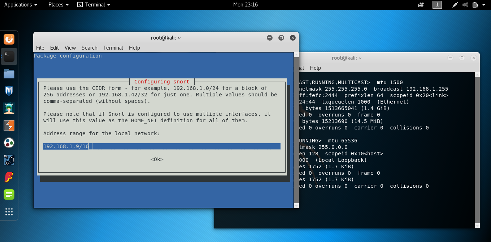
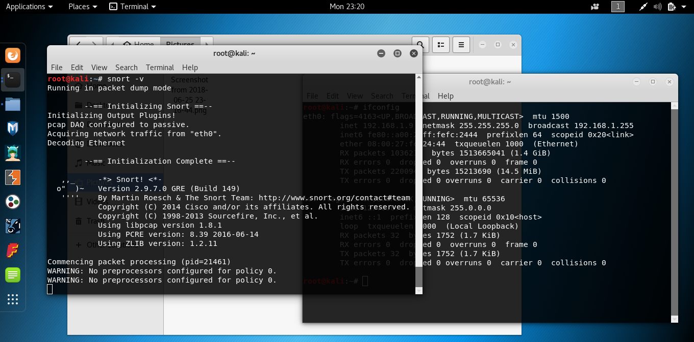
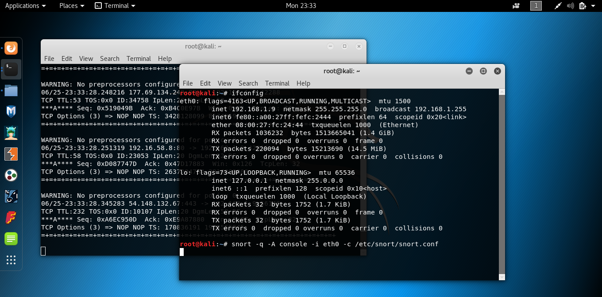

## IDS

Para a realização não tive problemas na execução do tutorial, porém, no último passo não sei identificar se a execução deu certo ou se houve algum problema pois não há nenhum retorno sobre o que está acontecendo.

