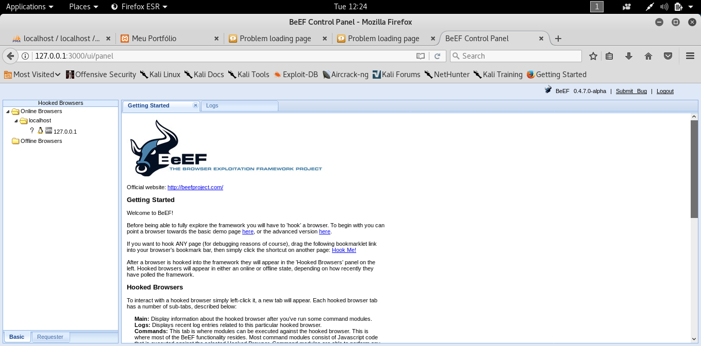

## XSS

Para a realização da prática tive um pouco de dificuldades devido a erros no tutorial, mas ao final foi possível finalizar a prática.

A seguir o passo a passo do que foi feito:

- Baixei os arquivos do tutorial e coloquei dentro da pasta ```/opt/lampp/htdocs```
- Executei o arquivo ```messeger.php``` no browser e coloquei o script informado no tutorial
- Após isso iniciei o Beef onde foi possível identificar o IP da máquina alvo possuindo assim acesso para realizar os ataques 



